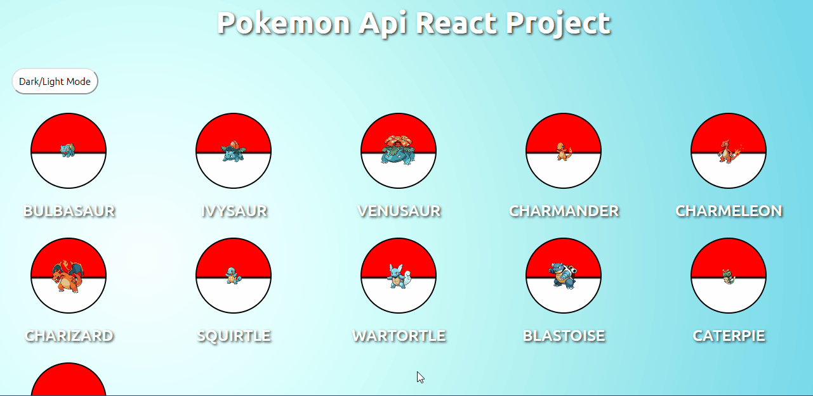
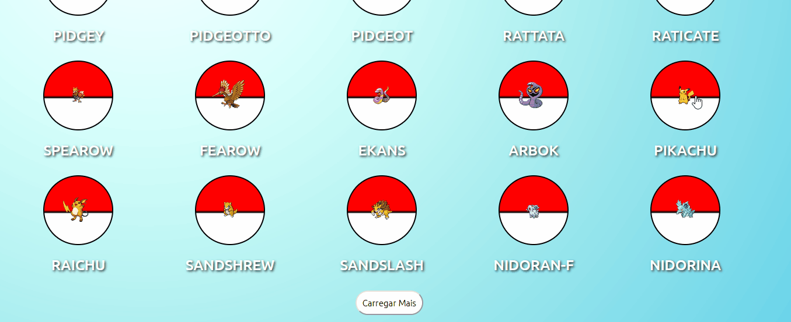
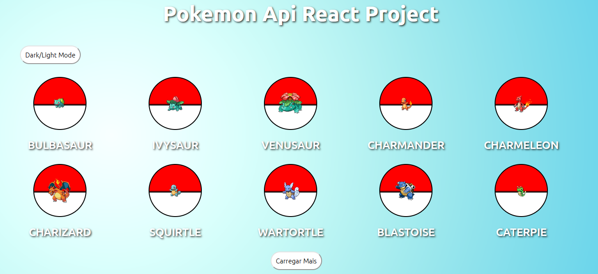
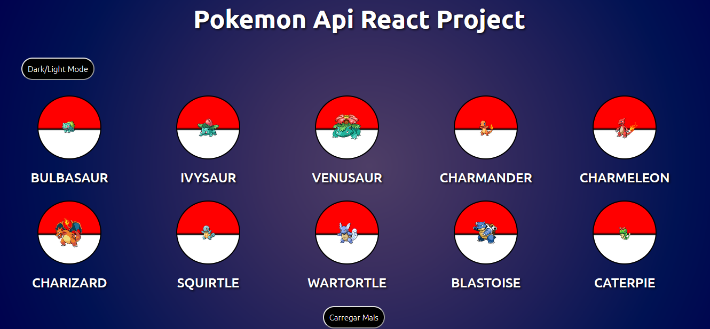
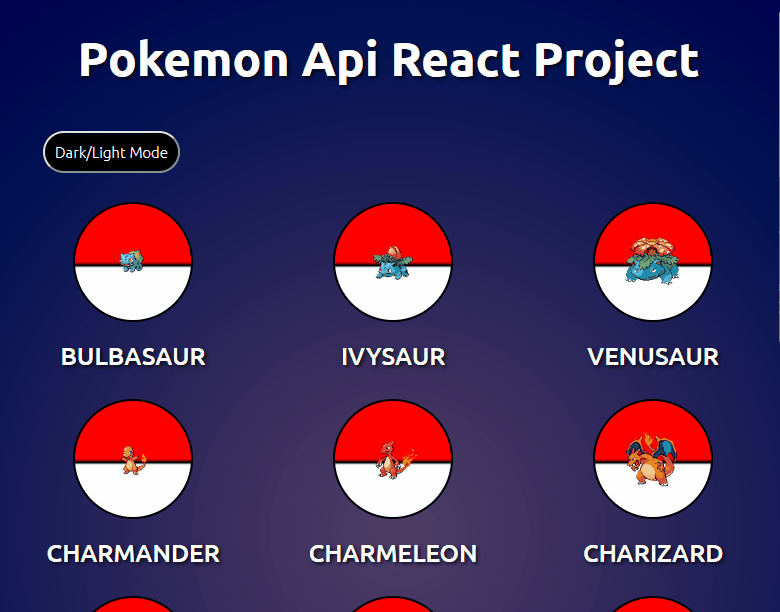

Este projeto foi criado para cumprir com o desafio de teste técnico do curso de desenvolvimento front-end DevQuest. Ele consiste numa simulação de uma Pokedex que apresenta os objetos dos pokemons na página principal e uma página onde contém a Pokedex propriamente dita com as descrições do pokemon selecionado.

<h2 align="center">🌐 Overview</h2>

Foi utilizada a biblioteca React para criar cada um dos componentes extraídos da <a href="https://pokeapi.co/">PokemonAPI</a>. Com um clique do usuário no botão "Carregar mais" uma nova requisição é feita à API que retorna outros 10 objetos com imagens e nomes dos pokemons. Todos os estilos dos componentes foram criados por meio de Styled Components, uma biblioteca do React que nos permite escrever código CSS dentro do JavaScript.

Quando o usuário clica em uma das pokebolas, ele é transferido para uma página onde terá um display com a imagem aumentada do pokemon selecionado e, ao lado, algumas informações como uma lista com alguns movimentos, as suas habilidade mais um texto descritivo a respeito destas e os tipos aos quais aquele pokemon faz parte. Para criar este componente foi utilizada a ferramenta de Rotas do React Router DOM.

<h2 align="center">✨ Temas</h2>

Para criar o Theme Toggler para alternar entre os modos claro e escuro foi utilizado o Context API que permite que criemos um contexto onde serão incluídos os componentes que receberão as propriedades passadas diretamente do elemento pai para os elementos filhos sem que utilizemos o efeito de <i>prop drilling</i>.

<h2 align="center">📱 Versão Mobile</h2>

<h2 align="center">🛠️ Tecnologias Utilizadas</h2>

- JavaScript
- React
    - Context.API
    - Styled Components
    - React Router DOM
- [PokemonAPI](https://pokeapi.co/)

<h2 align="center">🕘 Status</h2>

Para a finalidade de cumprir com desafio do curso, o projeto está concluído. Porém, mantenho o status em aberto para futuras implementações de outras funcionalidades.

💻 Page do projeto -  [Projeto React Api Pokemon](https://projeto-react-api-pokemon.vercel.app/)

🙋‍♂️ Perfil no LinkedIn - [Marks Henrik](https://www.linkedin.com/in/markshenrik/)
